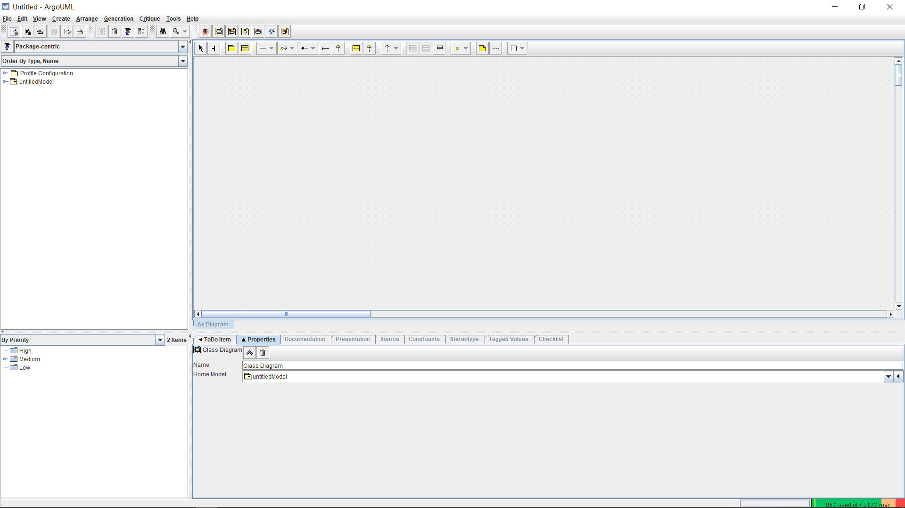

# ArgoUML SPL
SPL migration of the [ArgoUML]([https://](https://github.com/argouml-tigris-org/argouml)) application using [Mobioos Forge]([https://](https://marketplace.visualstudio.com/manage/publishers/mobioos))

## Start the Application and the Variants

### Prerequisites
The creation of the SPL has been achieved through the usage of [Mobioos Forge](https://documentation.mobioos.ai/). Consequently, to gain a comprehensive view of the FM and the SPL's maps, it is imperative to install Mobioos Forge within your [VScode](https://code.visualstudio.com/) editor. The extension will also allow you to generate new variants. You can acquire the extension through VScode's built-in extension
explorer or by accessing it [here](https://marketplace.visualstudio.com/items?itemName=Mobioos.mobioos-forge).

Regarding ArgoUML, since it is a Java-based application, you need to have the Java JDK installed on your environment. Furthermore, you must have JDK 8 to be able to fully run the application and its unit tests (available [here](https://www.oracle.com/fr/java/technologies/javase/javase8-archive-downloads.html)).
You will also need to have [Maven](https://maven.apache.org/download.cgi) installed to easily build and run the application.

### Build and Launch The App
With a terminal, navigate to the root of this repository, then run the following Maven command:
> mvn clean package

This command will also execute the tests alongside building the app. If you want to save time and skip the tests, add the flag *-DskipTests* like so:
> mvn clean package -DskipTests

Once the app is fully built, you can start the generated JAR with the following command:
> java -jar ./src/argouml-build/target/argouml-jar-with-dependencies.jar

Now your app should be up and running!

## Feature Model
The image below illustrates the feature model of the ArgoUML SPL.

The feature-model contains a total of 9 concrete features. Among those 9 features, 7 represent types of diagrams achievable within the application (*Class*, *State*, *Activity*, *Sequence*, *Use Case*, *Collaboration*, and *Deployment*). In addition to these 7 features, the feature-model also includes 2 features named *Cognitive Support* and *Logging*. *Cognitive Support*  offers insights to help diagram designers identify and resolve issues within their models. Logging, as the name implies, logs messages throughout the application's execution. All the features of the feature-model are optional, with the exception of *Class* which is mandatory.

In addition to these features, the feature model also incorporates the cross-tree constraint: *Activity ⇒ State*.
This cross-tree constraint was recommended to us by Mobioos Forge, which detected this dependency while we were mapping the features into the source code.

## Feature Mapping

The Table below shows data about the feature-mapping of the application.
| **Feature**           | **Mapping\-Time** | **Lines Of Codes \(LOCs\)** | **Impacted Files** | **Markers** | **Manually\-Validated Maps** | **Automatically\-Validated Maps** |
|-----------------------|-------------------|-----------------------------|--------------------|-------------|------------------------------|-----------------------------------|
| **Class**             | 00h 57m           | 6671                        | 68                 | 28          | 99                           | 91                                |
| **State**             | 00h 35m           | 5228                        | 64                 | 22          | 90                           | 107                               |
| **Activity**          | 00h 41m           | 7757                        | 96                 | 23          | 65                           | 161                               |
| **Use Case**          | 00h 31m           | 9297                        | 81                 | 35          | 53                           | 108                               |
| **Collaboration**     | 00h 54m           | 4475                        | 51                 | 22          | 56                           | 59                                |
| **Sequence**          | 00h 34m           | 6779                        | 113                | 21          | 34                           | 143                               |
| **Deployment**        | 00h 41m           | 7842                        | 93                 | 18          | 78                           | 267                               |
| **Cognitive Support** | 01h 37m           | 46126                       | 335                | 29          | 201                          | 2101                              |
| **Logging**           | 03h 24m           | 2079                        | 283                | 571         | 1067                         | 52                                |

## Variants

Several variants have been generated using MF's embedded variant derivation process. The Table below recaps the number of LOCs for those, the number of deleted lines relative to the original application's number of LOCs, and finally, the number of tests implemented in each variant.

| **Variant (enabled features)**                                         | **Lines Of Codes \(LOCs\)** | **Deleted Lines** | **Tests** |
|-----------------------------------------------------|-----------------------------|-------------------|-----------|
| **All features \(original application\)**          | 459391                      | 0                 | 1225      |
| **Only Class**                                     | 381693                      | 77698             | 937       |
| **Class, Use Case, Collaboration**                 | 390183                      | 69208             | 953       |
| **Class, State, Activity and Cognitive**           | 431903                      | 27488             | 1046      |
| **Class, State, Deployment, Sequence and Logging** | 397681                      | 61710             | 952       |
| **All diagrams features**                          | 411146                      | 48245             | 970       |

The source code for each of the variants is available on branches of this repo:
- Only Class: https://github.com/KarimGhallab/ArgoUML-SPL/tree/variants/only-class
- Class, Use Case, Collaboration: https://github.com/KarimGhallab/ArgoUML-SPL/tree/variants/class-use-case-collaboration
- Class, State, Activity, Cognitive: https://github.com/KarimGhallab/ArgoUML-SPL/tree/variants/class-state-activity-cognitive
- Class, State, Deployment, Sequence, Logging: https://github.com/KarimGhallab/ArgoUML-SPL/tree/variants/class-state-deployment-sequence-logging
- All diagrams features: https://github.com/KarimGhallab/ArgoUML-SPL/tree/variants/all-diagrams-enabled